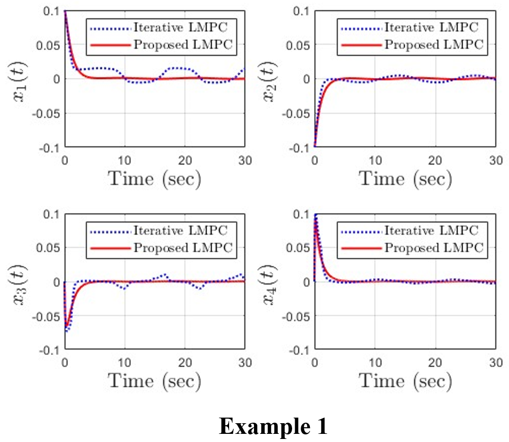

# Learning-based MPC of Sampled-data Systems with Partially Unknown Dynamics 
- Revision (Manuscript No.: ISATRANS-D-24-02658)


----

Original PyTorch implementation of **Learning-based MPC (LMPC)** by [Seungyong Han](https://sites.google.com/view/jbnu-dscl), [Xuyang Guo](https://ieeexplore.ieee.org/author/37089890974), [Suneel Kumar Kommuri](https://scholar.google.com/citations?user=JZT4bIYAAAAJ&hl=ko)

<p align="center">
  
  
  
</p>

# 1. Method

The proposed **LMPC** is a framework for sampled-data control systems with partially unknown dynamics. In the addressed system, a plant is dependent on a time-varying parameter whose dynamics is unknown. To learn the unknown dynamics, a neural network (NN) is trained using **a neural ordinary differential equation (NODE)**. The trained NN is integrated into the sampled-data MPC framework to estimate the time-varying parameter and predict future system states. The proposed LMPC method guarantees ultimate boundedness for the sampled data control system that operates with a continuous-time plant and a discrete-time control strategy.

<p align="center">
  
  
</p>

# 2. Getting Started
## Required Packages
- Python 3.8+
- MATLAB R2024b+
  - CasADi 3.6.7 (https://web.casadi.org/get/)
  - MPT 3.0 (https://people.ee.ethz.ch/~mpt/2/downloads/)

## Installation
Clone the repository:
```
bash

git clone https://github.com/seungyong-han/Learning-based-MPC.git
# This link will be publicly accessible once the paper is accepted.
```

## Install Python dependencies (e.g., via ```pip```):
```
bash

cd Learning-based-MPC
pip install -r requirements.txt
```

## MATLAB:
Open MATLAB and navigate to the relevant folder (e.g., ```NODE_LMPC_Run```, ```IterativeLMPC_Run```, etc.)
Run ```main.m``` from the MATLAB command window or script editor.

# 3. Instructions
Below is a step-by-step guide to each folder and how to run the corresponding scripts.

## Benchmark Problem
**3.1 Goal**: Compare the training performance of a Recurrent Neural Network (RNN) and a NODE using a spiral trajectory benchmark.

**3.2 Command**:
```
bash

python Benchmark/RNN_NODE_Train&Prediction.py
```
**3.3 Description**:
- Trains both RNN and NODE on a spiral trajectory dataset.
- Compares the prediction performance (e.g., trajectory tracking, loss, etc.)

## Example 1: Tracking Control Problem for Wheeled Mobile Robots
This example addresses a tracking control problem for a wheeled mobile robot with two types of time-varying parameters.

**3.4 Case 1**:
- **NODE_Train** folder: Run ```Ex1_Case1_NODE_Train.py``` (Python) to train the NODE.
- **NODE_LMPC_Run** folder: Run ```main.m``` (MATLAB) to execute the LMPC with the trained NODE.

**3.5 Case 2**
- The procedure is identical to Case 1.

## Example 2: Manipulator Robot Control System
This example handles a manipulator robot with external torque, again considering two time-varying parameter trajectories.

**3.6 Case 1**:
- **NODE_Train** folder: Run ```Ex2_Case1_NODE_Train.py``` (Python) to train the NODE.
- **NODE_LMPC_Run** folder: Run ```main.m``` (MATLAB) to execute the LMPC with the trained NODE.
- **IterativeLMPC_Run** folder: Run ```main.m``` to compare with the Iterative LMPC proposed in [1].
- **Comparison_Results** folder: Run ```main.m``` to compare both methods (NODE-LMPC vs. Iterative LMPC).

**3.7 Case 2**:
- **NODE_Train** folder: ```Run Ex2_Case2_NODE_Train.py``` (Python) to train the NODE.
- **NODE_LMPC_Run** folder: Run ```main.m``` (MATLAB) for the LMPC.
- **TDMPC_Train** folder: Train the agent (Temporal Difference MPC proposed in [2]) by calling
```
bash

python src/train.py task=mp-custom
```
After training, run ```Performance_test_custom_env.py``` to evaluate the agent’s performance.
- **Comparison_Results** folder: Run main.m to compare the proposed LMPC with TDMPC.

# 4. References
[1] U. Rosolia and F. Borrelli, "Learning Model Predictive Control for Iterative Tasks. A Data-Driven Control Framework," in IEEE Transactions on Automatic Control, vol. 63, no. 7, pp. 1883-1896, July 2018, [doi: 10.1109/TAC.2017.2753460](https://ieeexplore.ieee.org/abstract/document/8039204).

[2] N. Hansen, H. Su, and X. Wang, “Temporal difference learning for model predictive control,” in ICML, 2022, [doi: https://arxiv.org/abs/2203.04955](https://arxiv.org/abs/2203.04955).

# 5. License & Acknowledgements

[MuJoCo](https://github.com/deepmind/mujoco) and [DeepMind Control Suite](https://github.com/deepmind/dm_control) are licensed under the Apache 2.0 license. We thank the [DrQv2](https://github.com/facebookresearch/drqv2) authors for their implementation of DMControl wrappers.

## Contact
 - If you have questions or suggestions, please reach out via email [hansy@jbnu.ac.kr](mailto:hansy@jbnu.ac.kr).


